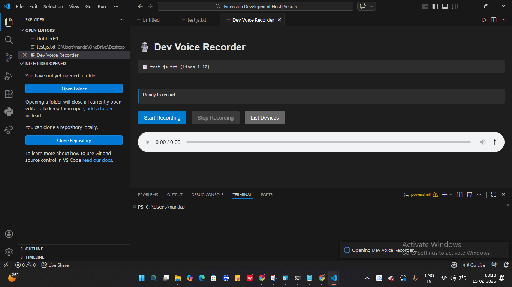
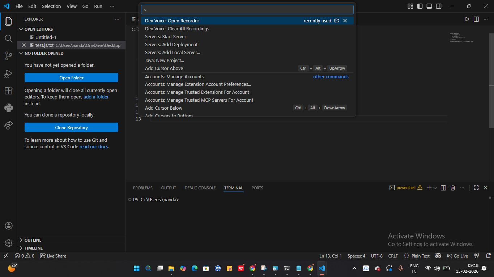

<p align="center">
  
</p>

# DevVoice 🎯

## Basic Details

### Team Name: SheCodes

### Team Members
- Member 1: Aamira Sageer - Saintgits College Of Engineering
- Member 2: Afrin Fathima Shine - Saintgits College Of Engineering

### Hosted Project Link
https://github.com/aamira04/shecodes.git

### Project Description
DevVoice is a VS Code extension that allows developers to record and play voice explanations for specific code blocks.
It helps users understand, revise, and revisit code by capturing the reasoning behind the logic in spoken form.

### The Problem statement
Developers often forget why certain logic was written, especially when revisiting old code or learning new concepts.
Text comments are time-consuming to write and often fail to capture the full intent behind the code.

### The Solution
DevVoice enables developers to attach short voice explanations directly to code blocks inside VS Code.
These audio notes stay separate from the source code, keeping files clean while making code easier to understand, revise, and explain.

---

## Technical Details

### Technologies/Components Used

**For Software:**
- Languages used: JavaScript,TypeScript,JSON
- Frameworks used: VS Code Extension API
- Libraries used: Node.js built-in modules,
   VS Code provided APIs
- Tools used: Visual Studio Code, Node.js, npm, Git


## Features

List the key features of your project:
-  Code-Block-Specific Voice Recording : Allows developers to record voice explanations for a selected block of code directly inside VS Code.
-  Audio Playback Within the Editor : Enables users to replay recorded explanations anytime while viewing the associated code.
-  Non-Intrusive Design : Voice explanations are stored separately and do not modify or clutter the source code files
- Learning & Revision Support : Helps students and developers revisit logic, understand reasoning, and revise code more effectively using audio explanations.
---

## Implementation

### For Software:

#### Installation
```bash
npm install
```

#### Run
```bash
npm run compile
```


## Project Documentation

### For Software:

#### Screenshots (Add at least 3)


The DevVoice Recorder panel allows developers to record voice explanations linked to a selected code block and replay them directly inside VS Code.
Voice recording and playback features exposed as native VS Code commands for quick access during development. 


.Voice recording and playback features exposed as native VS Code commands for quick access during development. 


A recorded voice explanation attached to a selected code block, with playback available directly inside the editor.

#### Diagrams

**System Architecture:**


DevVoice is designed as a layered VS Code extension architecture that cleanly separates user interaction, core logic, and storage.
This ensures simplicity, scalability, and non-intrusive integration with the editor.

**Application Workflow:**


DevVoice workflow illustrating the recording and listening flows, where developers attach voice explanations to code and later replay them in context.


#### Build Photos

[Team](images\WIN_20260215_10_00_48_Pro.jpg)


## Project Demo

### Video
[images\Screen Recording 2026-02-15 092415.mp4]

This video briefly shows the working of DevVoice. A test code is written and the explanation for that code is recorded and played.


## AI Tools Used (Optional - For Transparency Bonus)

**Tool Used:** ChatGPT, Gemini


**Human Contributions:**
- Architecture design and planning
- Custom business logic implementation
- Integration and testing
- UI/UX design decisions

*Note: Proper documentation of AI usage demonstrates transparency and earns bonus points in evaluation!*

---


## License

This project is licensed under the [LICENSE_NAME] License - see the [LICENSE](LICENSE) file for details.

**Common License Options:**
- MIT License (Permissive, widely used)
- Apache 2.0 (Permissive with patent grant)
- GPL v3 (Copyleft, requires derivative works to be open source)

---

Made with ❤️ at TinkerHub
